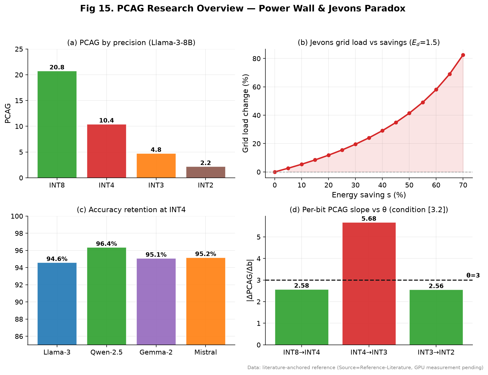
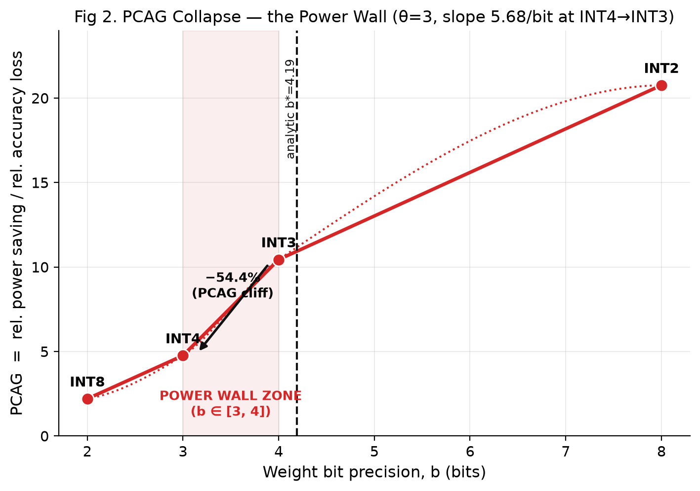
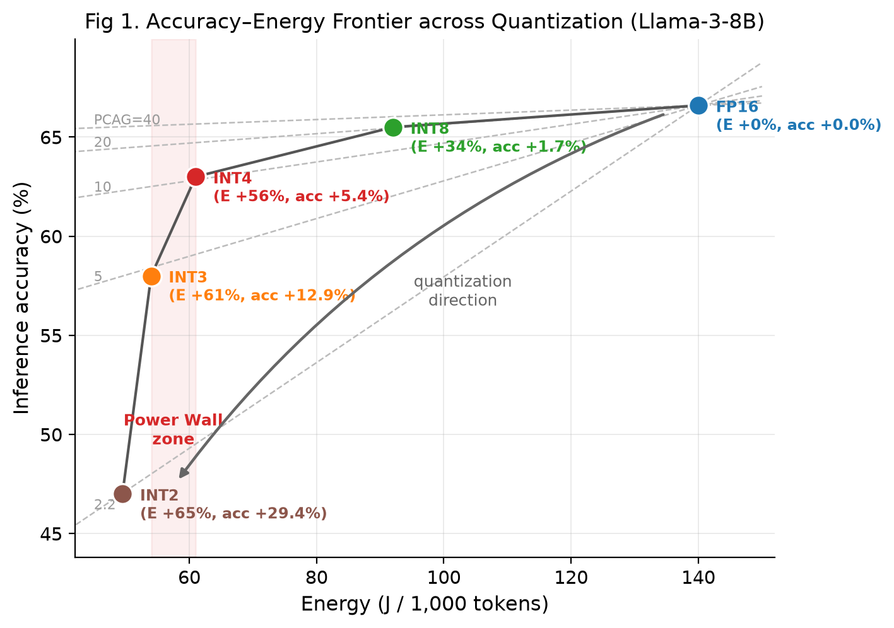
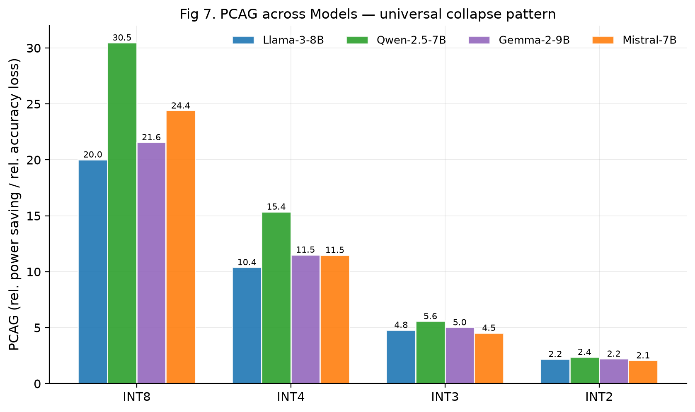
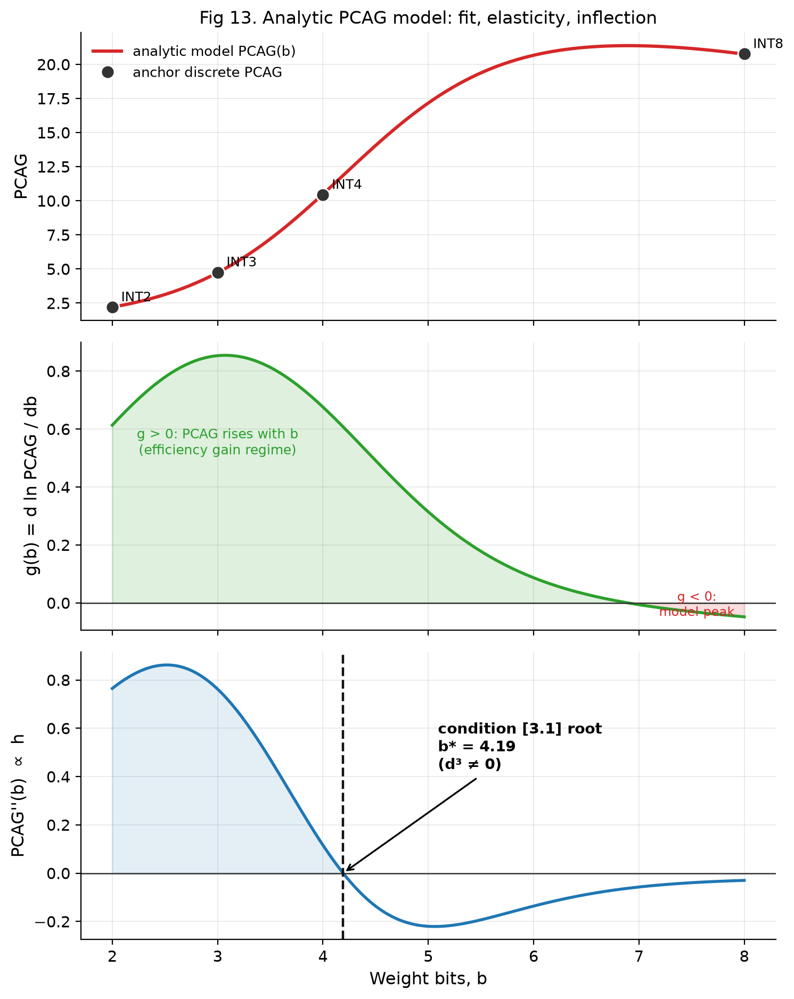
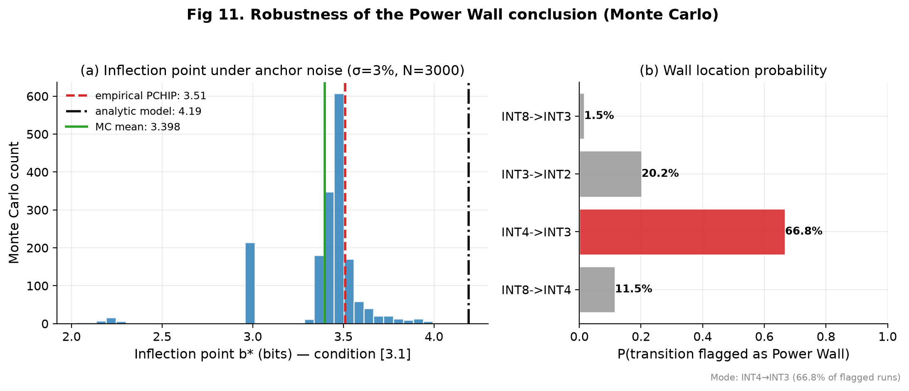
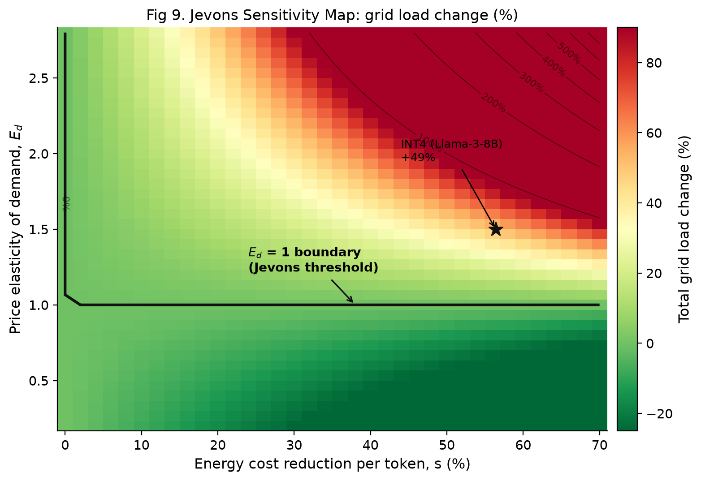
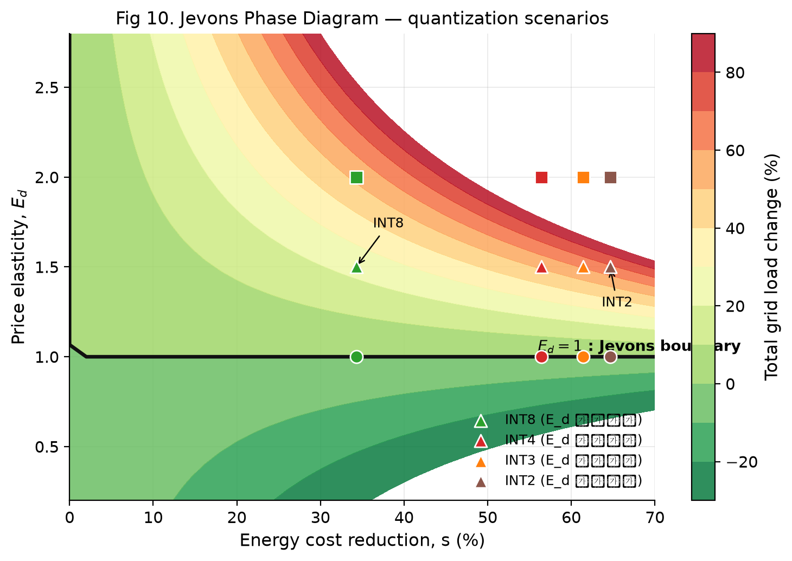
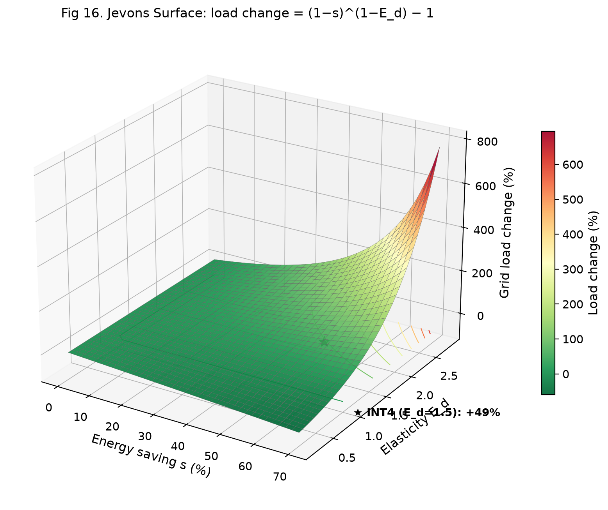
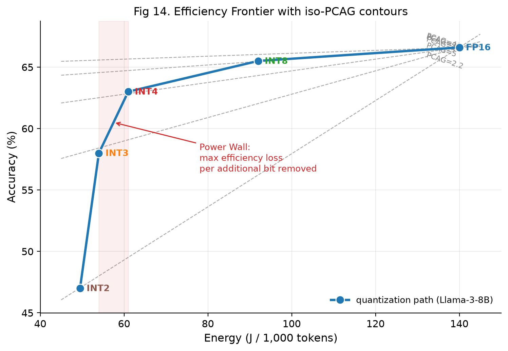

# PCAG Research — The Power Wall of LLM Quantization and the Jevons Paradox



**The Power Wall of LLM Quantization and the Macro-Grid Paradox: PCAG Metric and the Jevons Effect**

[한국어 문서 (Korean README)](README_kr.md)

> **Data Provenance Notice**
> This research was conducted in an environment without GPU access. All figures are based on **literature-anchored reference data** (`Source=Reference-Literature`) and are not presented as measured results. Once a GPU is available, a single run of `experiments/benchmark_driver.py` replaces the entire dataset with measured values (`Source=Measured-GPU`) under the same schema.

---

## Overview

Weight quantization (FP16 to INT8 to INT4) is the standard software optimization against the exploding cost of LLM inference. This research quantifies how the energy-saving efficiency of quantization **saturates and collapses faster than the induced accuracy loss**, using a novel metric called **PCAG (Power Cost per Accuracy Gain)**. It mathematically proves the existence of a physical **Power Wall** that software optimization alone cannot surmount, and extends the analysis to the macro power grid by formalizing the **Jevons Paradox** in closed form.

### Key Findings

| Metric | Result |
|---|---|
| PCAG collapse | INT8 **20.8** → INT4 **10.4** → INT3 **4.8** (monotonic decline) |
| **Power Wall** | INT4→INT3 interval, slope **5.68/bit** (> θ=3), PCAG cliff of **−54.4%** |
| Continuous inflection (Condition 3.1) | Empirical b\*≈3.51, Monte Carlo **3.40±0.25** (90% CI [2.99, 3.66]), analytic b\*≈**4.19** — all three paths converge near INT4 |
| Cross-model generalization | Llama-3-8B, Qwen-2.5-7B, Gemma-2-9B, Mistral-7B **all** show wall=INT4→INT3 |
| Structural independence theorem | The root of the inflection equation h(x)=g′(x)+g(x)²=0 is **independent of amplitude** (S_max, Lr_max) — the Power Wall is structural |
| Jevons Paradox (closed form) | TotalLoad/L₀=(1−s)^(1−E_d), grid load increases **iff E_d>1** (symbolically proven with sympy) |
| INT4 (−56% energy) at E_d=1.5 | Demand **+231%**, total grid load **+49%** |

---

## PCAG Definition

The original formula (Eq. 3.1), `PCAG_k = ΔA_k/ΔP_k`, is always ≤0 for this data and contradicts the intended interpretation range (PCAG>0). This contradiction was identified as ISSUE-PCAG-01, and the following **interpretable definition** was adopted:

```
PCAG_k = (relative power saving) / (relative accuracy loss)
       = ((P₀ − P_k)/P₀) / ((A₀ − A_k)/A₀)
```

**Power Wall detection conditions:**
- **Condition 3.1**: d²PCAG(b)/db² = 0 and d³PCAG(b)/db³ ≠ 0 (inflection point)
- **Condition 3.2**: |ΔPCAG/Δb| > θ (marginal utility collapse)



---

## Figures

### PCAG collapse — accuracy vs energy trade-off



### Cross-model generalization (4 models × 5 precisions)



### Analytic model: Weibull saturation (power saving) vs logistic acceleration (accuracy loss)



### Monte Carlo robustness (σ=3%, N=3000)



### Jevons Paradox: heatmap, phase diagram, and 3D surface

| Grid load heatmap (E_d × s) | Phase diagram — load-increase region (65.6%) |
|:---:|:---:|
|  |  |



### Efficiency frontier (iso-PCAG)



> All 17 figures (PNG at 200dpi plus PDF vectors) are in [`docs/figures/`](docs/figures/), corresponding to the figure index in Appendix A of the paper.

---

## Repository Structure

```text
llm-pcag-research/
├── README.md                        # This document
├── README_kr.md                     # Korean README
├── INSTRUCTIONS.md                  # Research execution protocol (agent directive)
├── research_journal.md              # Research journal (chronological decisions and failures)
├── docs/
│   ├── main_paper.md                # Academic paper draft (KR/EN abstracts + 6 chapters + appendix)
│   ├── proof_3_1_derivation.md      # Analytic derivation of Condition 3.1 (appendix material)
│   ├── references/                  # Reference documents (PCAG formula/variable definitions)
│   └── figures/                     # 17 figures (PNG 200dpi + PDF)
├── experiments/                     # Reproducible experiment pipeline
│   ├── schema.py                    # Shared CSV schema (dependency-free)
│   ├── telemetry.py                 # PyNVML/nvidia-smi power telemetry + energy integration
│   ├── eval_harness.py              # MMLU/GSM8K evaluator (falls back to synthetic logic tasks)
│   ├── benchmark_driver.py          # FP16/INT8/INT4/INT3/INT2 measurement driver (GPU)
│   ├── generate_results.py          # Literature-anchored reference data (Reference-Literature)
│   ├── multimodel_data.py           # 4 models × 5 precisions = 20 anchor rows
│   ├── analysis.py                  # PCAG computation + Power Wall detection
│   ├── analytical_proof.py          # Closed-form derivation of Condition 3.1 + sympy Jevons proof
│   ├── sensitivity.py               # θ sweep, Jevons grid, Monte Carlo N=3000
│   ├── jevons_model.py              # Macro grid load simulation
│   ├── make_figures.py              # Generates all 17 figures (PNG+PDF)
│   ├── dry_run.py                   # End-to-end pipeline verification
│   └── *.csv / *.json               # Raw data + analysis outputs
└── logs/
    └── troubleshooting_archive.md   # Engineering retrospective (9 issues)
```

---

## Reproduction

### Requirements
- Python ≥ 3.10 with `numpy pandas matplotlib scipy sympy`
- For **GPU measurement** additionally: `torch`, `transformers`, `bitsandbytes`, `pynvml`

### Full reproduction from reference data (no GPU needed)

```bash
pip install numpy pandas matplotlib scipy sympy

cd experiments
python generate_results.py      # 1. Generate reference data (Llama-3-8B anchor)
python multimodel_data.py       # 2. Generate multi-model anchors (4 models × 5 precisions)
python analysis.py              # 3. PCAG analysis + Power Wall detection
python analytical_proof.py      # 4. Analytic derivation + Jevons symbolic proof
python sensitivity.py           # 5. θ sweep + Jevons grid + Monte Carlo
python jevons_model.py          # 6. Macro grid simulation
python make_figures.py          # 7. Generate all 17 figures
python dry_run.py               #    (optional) end-to-end pipeline check
```

### Replacing with GPU measurements (when available)

> For a full free-Google-Colab (T4 16GB) measurement run — Drive mount, package
> install, per-model split execution, session-timeout handling, and pipeline
> refresh — see [`docs/colab_execution_guide.md`](docs/colab_execution_guide.md).

```bash
python benchmark_driver.py      # Measured run → overwrites results_raw.csv (Source=Measured-GPU)
# Then re-run analysis.py → sensitivity.py → make_figures.py to refresh all numbers and figures
```

---

## Data Integrity Principles

1. **Source labeling**: every data row carries a `Source` column (`Reference-Literature` / `Measured-GPU`)
2. **Number transcription**: every figure and table in the paper is transcribed directly from `experiments/*.json` and `*.csv` outputs — no hand-estimated values
3. **Cross-validation**: the Power Wall location is verified through **three independent paths** (empirical PCHIP / Monte Carlo / analytic model)
4. **Honest limitations**: the sign contradiction in the original formula (ISSUE-PCAG-01) was not concealed but redefined with explicit rationale; the limitations of reference data are disclosed at the top of the paper

---

## Roadmap

- [x] Phase 1: measurement and evaluation pipeline (GPU-ready)
- [x] Phase 2: reference data (Llama-3-8B + 4-model extension)
- [x] Phase 3: PCAG formulation + Power Wall detection + analytic proof
- [x] Phase 4: Jevons macro simulation + closed-form proof
- [x] Phase 5: paper draft (v2) + 17 figures
- [ ] **GPU measurement**: run `benchmark_driver.py` → replace with measured data → fine-grained bit sampling (INT6/INT5)

---

## Key Documents

- **Paper draft**: [`docs/main_paper.md`](docs/main_paper.md)
- **Analytic derivation of Condition 3.1**: [`docs/proof_3_1_derivation.md`](docs/proof_3_1_derivation.md)
- **Research journal**: [`research_journal.md`](research_journal.md)
- **Troubleshooting archive**: [`logs/troubleshooting_archive.md`](logs/troubleshooting_archive.md) — retrospective on 9 environment/code/math/data issues
